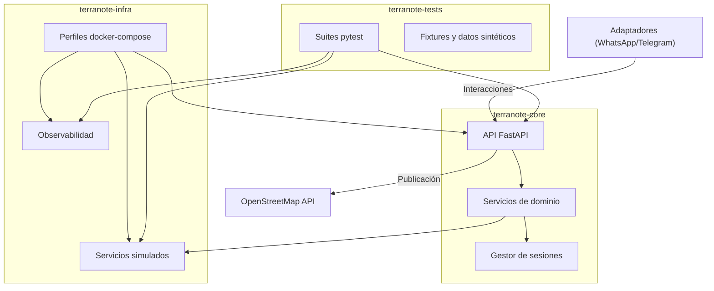

# Arquitectura de Plataforma

## Visión general

## Componentes

- `terranote-core`: definición detallada en [`overview.md`](https://github.com/Terranote/terranote-core/blob/main/docs/overview.md).
- `terranote-infra`: perfiles `docker-compose` para levantar core, fakes y observabilidad ([README](https://github.com/Terranote/terranote-infra/blob/main/README.md)).
- `terranote-tests`: suites de integración y carga que consumen la API del core ([README](https://github.com/Terranote/terranote-tests/blob/main/README.md)).
- Adaptadores: conectores de mensajería (p. ej. [WhatsApp](https://github.com/Terranote/terranote-adapter-whatsapp)).

## Flujos clave

1. El adaptador envía interacciones al endpoint `/api/v1/interactions`.
2. `terranote-core` agrupa mensajes, construye borradores y publica notas en OSM.
3. Las notificaciones regresan al adaptador mediante callbacks configurables.
4. Las métricas se exponen vía `/metrics` y se recolectan con Prometheus levantado por `terranote-infra`.

